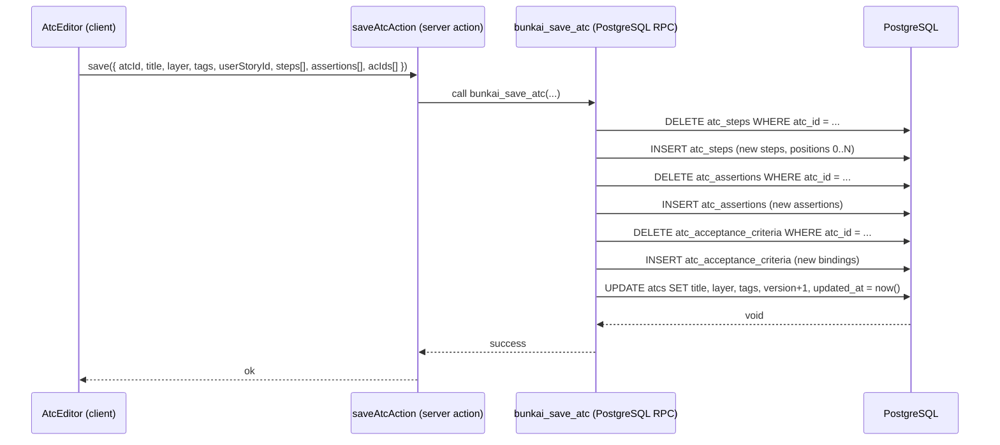

# SRS — Architecture

> **Discovery date**: 2026-05-31  
> **Method**: Source code analysis (middleware.ts, lib/supabase/, supabase/migrations/, app/api/, next.config.ts)  
> **Status**: Discovered — reflects current implementation, not aspirational design

---

## C4 Context Diagram

```
+----------------------------------------------------------+
|                     BUNKAI SYSTEM                        |
|                                                          |
|  +------------------+       +------------------------+  |
|  |  Browser Client  |       |   CLI / AI Agent       |  |
|  |  (React 19 SPA)  |       |  (Claude, OpenCode,    |  |
|  |  Cookie session  |       |   GitHub Actions)      |  |
|  +--------+---------+       +----------+-------------+  |
|           |                            |                 |
|           +----------+   +-------------+                 |
|                      |   |                               |
|           +----------v---v-----------+                   |
|           |   Next.js 15 App Router  |                   |
|           |   (FE + BE, monorepo)    |                   |
|           |   Vercel Edge Functions  |                   |
|           +----------+--------------+                    |
|                      |                                   |
|           +----------v--------------+                    |
|           |   Supabase Cloud        |                    |
|           |   - PostgreSQL 16       |                    |
|           |   - Auth (magic-link)   |                    |
|           |   - Row Level Security  |                    |
|           |   - Storage (planned)   |                    |
|           +-------------------------+                    |
+----------------------------------------------------------+
```

Source: `package.json` (Next.js 15, @supabase/ssr), `.agents/project.yaml` (Vercel deploy)

---

## C4 Container Diagram

```
+-------------------------------------------------------------------+
|  BUNKAI — Container View                                          |
|                                                                   |
|  [Browser]                                                        |
|    React 19 + Tailwind + shadcn/ui                                |
|    - App Router pages (RSC + Client Components)                   |
|    - Monaco Editor (ATC steps/assertions)                         |
|    - TanStack Table (ATC list)                                    |
|    - Sonner (toasts)                                              |
|         |                                                         |
|         | HTTPS / Cookie (browser)                                |
|         | HTTPS / Bearer PAT (CLI/agent)                          |
|         |                                                         |
|  [Next.js 15 — Vercel]                                           |
|    +---------------------------+  +---------------------------+   |
|    |  App Router (FE)          |  |  API Routes (BE)          |   |
|    |  /projects/[slug]         |  |  /api/v1/auth/*           |   |
|    |  /projects/[slug]/atcs/*  |  |  /api/v1/workspaces/*     |   |
|    |  /onboarding              |  |  /api/v1/me/*             |   |
|    |  /workspaces/[id]/members |  |  /api/v1/tokens/*         |   |
|    |  /login                   |  |  /api/v1/invites/*        |   |
|    |  /invites/accept          |  |  /api/v1/health           |   |
|    |  /auth/callback           |  |  /api/openapi             |   |
|    |  /qa (public)             |  |  /api/docs (Scalar UI)    |   |
|    |  /design-tokens (public)  |  |                           |   |
|    +---------------------------+  +---------------------------+   |
|         |                                    |                    |
|         +------------------------------------+                    |
|                         |                                         |
|                         | Supabase JS (@supabase/ssr)             |
|                         |                                         |
|  [Supabase Cloud]                                                 |
|    +---------------------------+  +---------------------------+   |
|    |  PostgreSQL 16            |  |  Supabase Auth            |   |
|    |  - 18 tables              |  |  - Magic-link OTP         |   |
|    |  - 12 migrations          |  |  - Session cookies        |   |
|    |  - RLS on all tables      |  |  - auth.users table       |   |
|    |  - 4 SECURITY DEFINER fns |  |                           |   |
|    |  - 2 stored procedures    |  |                           |   |
|    |  - 2 triggers             |  |                           |   |
|    +---------------------------+  +---------------------------+   |
+-------------------------------------------------------------------+
```

---

## Component Structure

### Frontend Components (`components/`)

```
components/
├── atcs/
│   ├── AtcTable.tsx        — paginated/filterable ATC list (TanStack Table)
│   ├── AtcEditor.tsx       — full ATC editor (steps + assertions + anchoring)
│   ├── StepEditor.tsx      — inline step editor (content, input_data, expected)
│   └── AnchoringPanel.tsx  — AC picker (story grouping → AC list)
├── layout/
│   ├── Topbar.tsx          — header: workspace/project breadcrumbs + palette + actions
│   ├── Sidebar.tsx         — hierarchical module tree navigator
│   ├── CommandPalette.tsx  — Cmd+K quick action overlay
│   ├── WorkspaceSwitcher.tsx — workspace picker dropdown
│   └── Wordmark.tsx        — Bunkai brand logo
├── providers/
│   └── auth-context.tsx    — AuthProvider: session + user state (React context)
└── ui/                     — shadcn component library primitives
    ├── button.tsx, input.tsx, label.tsx, card.tsx
    ├── tabs.tsx, badge.tsx, dropdown-menu.tsx
    └── dialog.tsx, tooltip.tsx
```

### Backend Library (`lib/`)

```
lib/
├── api/
│   ├── auth.ts             — requireAuth(): dual-mode (cookie + Bearer PAT)
│   ├── handler.ts          — withApiHandler(): response wrapper + JSON helpers
│   ├── error-envelope.ts   — structured error responses
│   ├── logging.ts          — request/response logging
│   ├── request-id.ts       — idempotency key + request ID
│   ├── idempotency.ts      — POST replay deduplication (24h TTL)
│   ├── pat.ts              — PAT validation (prefix lookup → hash verify)
│   ├── invite-tokens.ts    — invite code generation/validation
│   └── middleware/
│       └── bearer.ts       — Authorization: Bearer header extraction
├── supabase/
│   ├── client.ts           — browser Supabase client (createBrowserClient)
│   ├── server.ts           — server Supabase client (createServerClient + cookies)
│   ├── admin.ts            — service-role client (privileged ops)
│   ├── rpc.ts              — stored procedure calling utilities
│   └── with-workspace.ts   — workspace context injection helper
├── openapi/
│   └── registry.ts         — OpenAPI spec builder (zod-to-openapi)
├── types.ts                — all domain entity types (Workspace, Project, ATC, etc.)
├── types/supabase.ts       — Supabase-generated types (Phase D stub)
├── env.ts                  — environment variable schema + validation (Zod)
├── urls.ts                 — URL building helpers
├── utils.ts                — general utilities
├── tree.ts                 — module tree builder (hierarchical grouping)
└── atc-parse.ts            — ATC content parsing (steps, assertions, variables)
```

---

## Database Schema

### Entity Relationship (simplified)

```
auth.users (Supabase managed)
  |
  +-- workspaces (owner_user_id)
  |     |
  |     +-- workspace_members (user_id, role, status)
  |     +-- projects
  |     |     |
  |     |     +-- modules (self-referential tree, max depth 6)
  |     |           |
  |     |           +-- user_stories
  |     |                 |
  |     |                 +-- acceptance_criteria (ordered)
  |     |                       |
  |     |                       +-- atc_acceptance_criteria (M:N)
  |     |
  |     +-- atcs (project_id + module_id + user_story_id)
  |     |     +-- atc_steps (ordered)
  |     |     +-- atc_assertions (ordered)
  |     |     +-- atc_acceptance_criteria (M:N)
  |     |
  |     +-- access_tokens <-> access_token_secrets (1:1)
  |     +-- workspace_invites <-> workspace_invite_secrets (1:1)
  |     +-- activity_log
  |     +-- idempotency_keys
  |     +-- feature_flags
  |
  +-- magic_link_tokens <-> magic_link_token_secrets (1:1)
  +-- user_view_state (user_id + project_id)
```

### Tables Summary (18 tables across 12 migrations)

| Migration | Tables Created |
|---|---|
| 0001_tenancy | workspaces, workspace_members |
| 0002_projects_modules | projects, modules |
| 0003_authoring | user_stories, acceptance_criteria |
| 0004_atcs | atcs, atc_steps, atc_assertions, atc_acceptance_criteria |
| 0005_rls_helpers | (RLS policies + helper functions refactor) |
| 0006_bootstrap_workspace | (RPC: bunkai_bootstrap_workspace) |
| 0007_save_atc | (RPC: bunkai_save_atc) |
| 0008_access_tokens | access_tokens, access_token_secrets |
| 0009_cross_cutting | activity_log, idempotency_keys, feature_flags, user_view_state, magic_link_tokens, magic_link_token_secrets |
| 0010_workspace_invites | workspace_invites, workspace_invite_secrets |
| 0011_split_token_secrets | (refactor: secret isolation) |
| 0012_drop_legacy_token_hashes | (cleanup) |

---

## Authentication Architecture

### Dual-Mode Auth

```
Browser User (cookie)                CLI / AI Agent (Bearer PAT)
      |                                         |
      v                                         v
POST /api/v1/auth/magic-link         POST /api/v1/auth/signin
      |                               { email, password, pat_scopes }
      v                                         |
Supabase sends OTP email                        v
      |                               Supabase.signInWithPassword()
      v                                         |
GET /auth/callback?code=...                     v
      |                               Mint PAT (access_tokens table)
      v                                         |
exchangeCodeForSession()                        v
      |                               Return { session, pat: { token: "bk_pat_..." } }
      v                                         |
Supabase cookie set                             v
      |                               Subsequent calls:
      v                               Authorization: Bearer bk_pat_<prefix>.<secret>
All requests: cookie auth                       |
      |                                         v
      v                               lib/api/pat.ts: prefix lookup
requireAuth() → cookie path          → hash verify → resolve userId + scopes
```

### PAT Token Format
```
bk_pat_<12-char-prefix>.<32-byte-secret-base64url>
```
- Prefix stored in `access_tokens.token_prefix` (O(1) lookup)
- Full secret SHA-256 hash stored in `access_token_secrets.hash`
- Raw token returned exactly once at creation

### Middleware Routing
```
Incoming request
      |
      v
middleware.ts (Next.js middleware)
      |
      +-- OPTIONS → passthrough (CORS preflight)
      |
      +-- /projects/* or /onboarding/*
      |         |
      |         v
      |   supabase.auth.getUser() (refreshes session)
      |         |
      |         +-- no user → redirect /login?next=[pathname]
      |         +-- user found → continue
      |
      +-- /login/* or /auth/* or /api/auth/* → passthrough
      |
      +-- everything else → passthrough
```

---

## Security Model

### Row Level Security (RLS)

All 18 tables have RLS enabled. Authorization hierarchy:

```
1. Is caller authenticated? (auth.uid() IS NOT NULL)
2. Is caller an active workspace member? (bunkai_is_workspace_member(workspace_id))
3. Does caller have write permissions? (bunkai_can_write_workspace(workspace_id))
4. Is caller admin/owner? (bunkai_is_workspace_admin / bunkai_is_workspace_owner)
```

### SECURITY DEFINER Helper Functions (prevent infinite recursion)
- `bunkai_is_workspace_member(ws_id uuid) → boolean`
- `bunkai_can_write_workspace(ws_id uuid) → boolean` (role ≥ member)
- `bunkai_is_workspace_admin(ws_id uuid) → boolean`
- `bunkai_is_workspace_owner(ws_id uuid) → boolean`

### Secret Isolation Pattern
Token secrets (PAT, invite, magic-link) stored in 1:1 sibling tables, excluded from QA/analytics roles:
- `access_token_secrets` (1:1 with `access_tokens`)
- `workspace_invite_secrets` (1:1 with `workspace_invites`)
- `magic_link_token_secrets` (1:1 with `magic_link_tokens`)

---

## Data Flow Diagrams

### ATC Save Flow



### Magic-Link Auth Flow

```mermaid
sequenceDiagram
  participant Browser
  participant NextJS as Next.js /api/v1/auth/magic-link
  participant Supabase
  participant Email as Email Provider

  Browser->>NextJS: POST { email, next }
  NextJS->>Supabase: auth.signInWithOtp({ email })
  Supabase->>Email: Send OTP link → /auth/callback?code=...
  Email-->>Browser: User clicks link
  Browser->>NextJS: GET /auth/callback?code=...&next=/projects
  NextJS->>Supabase: auth.exchangeCodeForSession(code)
  Supabase-->>NextJS: session + user
  NextJS-->>Browser: Set-Cookie: supabase session; redirect /projects
```

---

## External Services

| Service | Purpose | Integration point |
|---|---|---|
| Supabase Auth | User authentication (magic-link OTP) | `lib/supabase/server.ts`, `lib/supabase/client.ts` |
| Supabase PostgreSQL | All application data | All `lib/supabase/*.ts` clients |
| Vercel | Hosting + edge functions | Deployment (no config found in source) |
| Resend | Transactional email (planned) | `RESEND_API_KEY` in `.env.example` — not yet wired |

---

## Discovery Gaps

- [ ] **Vercel configuration**: No `vercel.json` found in repo. Deploy settings (regions, environment variable mapping, build commands) not confirmed.
- [ ] **Supabase local dev config**: `supabase/config.toml` existence and contents not confirmed.
- [ ] **OpenAPI spec completeness**: `/api/openapi` generates spec at runtime via zod-to-openapi. Confirm all endpoints are registered in `lib/openapi/registry.ts`.
- [ ] **pgvector**: `.agents/project.yaml` mentions pgvector "planned for Phase 2" — no migrations for it yet.
- [ ] **Storage**: Supabase Storage mentioned in C4 diagram as "(planned)" — no bucket config found.
